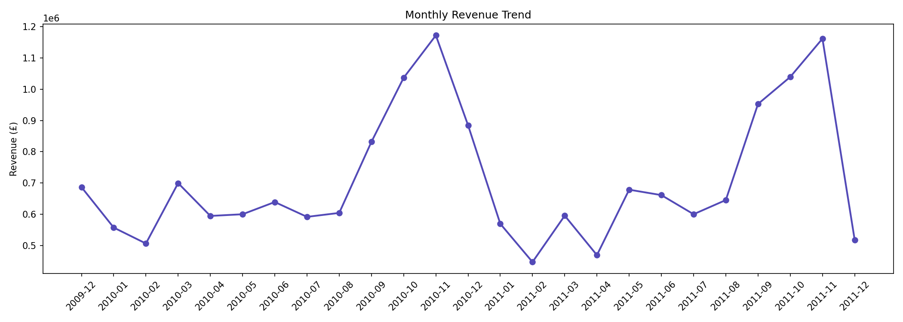
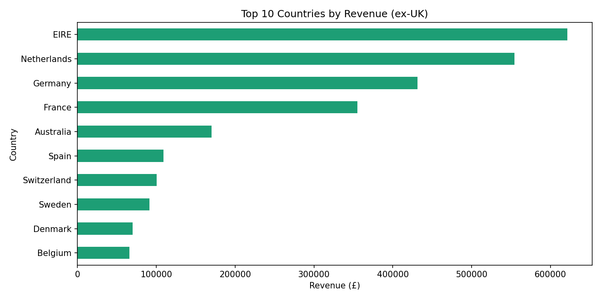
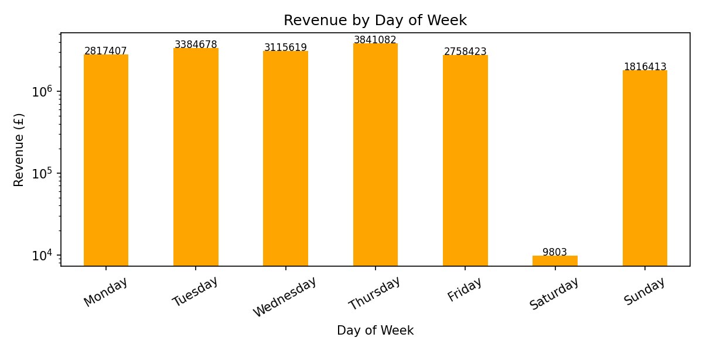
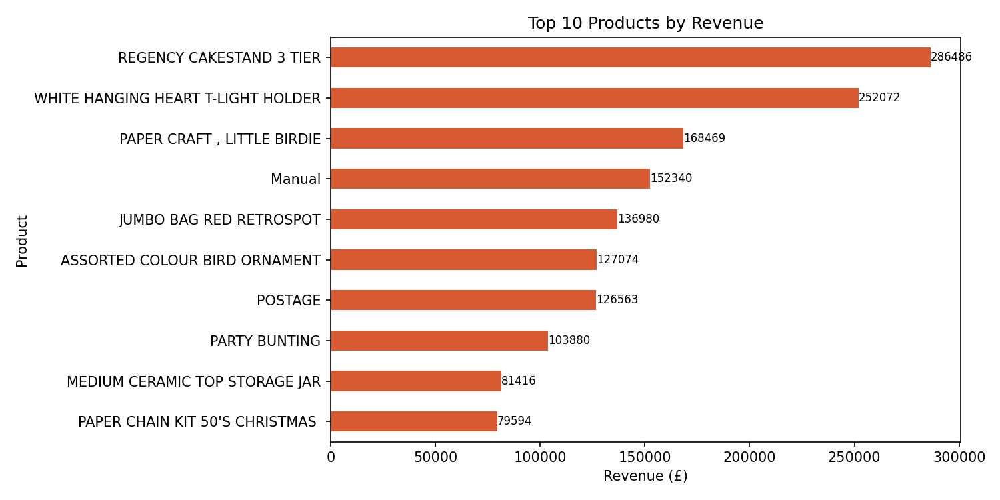
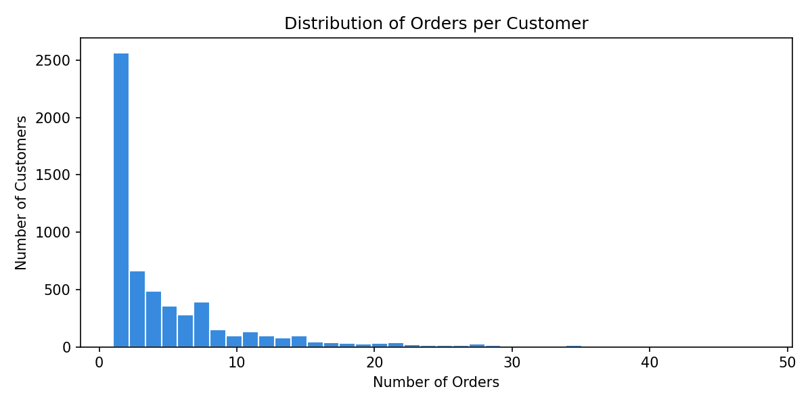
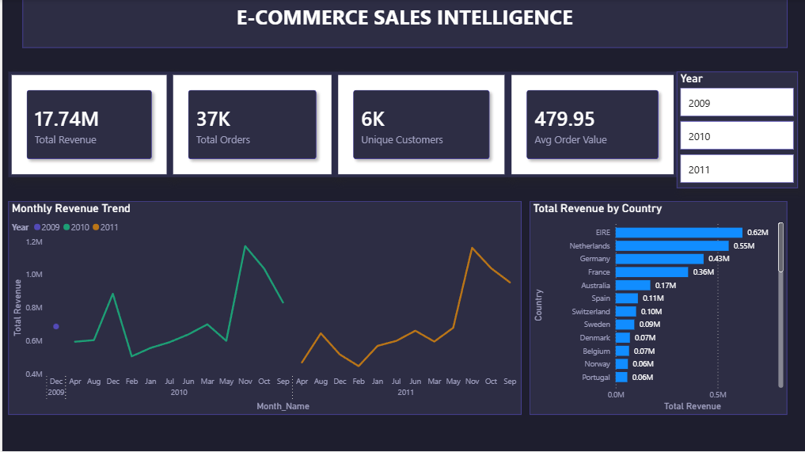
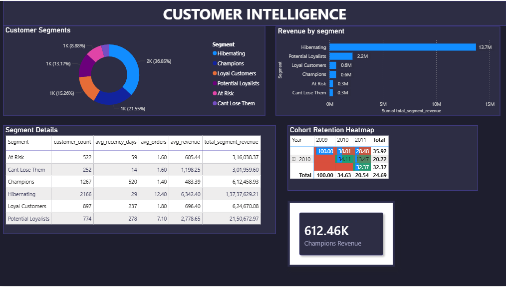
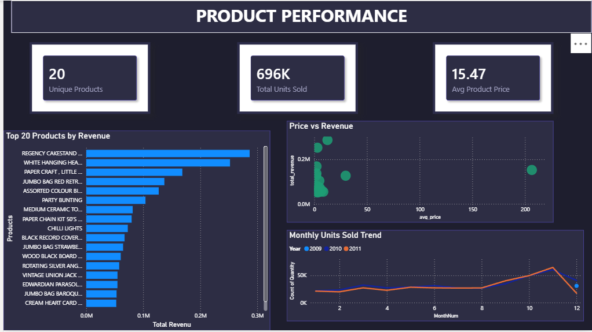

# E-Commerce-Sales-Customer-Intelligence-Dashboard
---

## Project Overview

This project analyses **2 years of real transactional data** (Dec 2009 – Dec 2011) from a UK-based online retailer selling unique all-occasion gift-ware. The dataset contains over **1 million rows** across **38 countries**, sourced from the UCI Machine Learning Repository.

The goal was to simulate a real analyst's end-to-end workflow — cleaning messy data, performing SQL-based business analysis, building Excel pivot reports, and delivering an interactive 3-page Power BI executive dashboard with actionable insights.

---

## Tools & Technologies

| Tool | Purpose |
|---|---|
| **Python** (Pandas, NumPy, Matplotlib, Seaborn) | Data cleaning, EDA, RFM table calculation |
| **SQL** (MySQL) | Business analysis, RFM scoring , cohort retention |
| **Excel** | KPI summary sheet with pivot tables and slicers |
| **Power BI** | Interactive 3-page executive dashboard with DAX measures |

---
## Dataset

- **Name:** Online Retail II (UCI Machine Learning Repository)
- **Download:** [Kaggle Link](https://www.kaggle.com/datasets/mashlyn/online-retail-ii-uci)
- **Size:** 1,067,371 rows | 8 columns | 38 countries
- **Period:** December 2009 to December 2011

> Note: The raw data file is not uploaded here due to size. Download it from the link above and place it in the `data/raw/` folder.

---
## Step 1 — Data Cleaning (Python)

The raw data had several issues that needed fixing before any analysis.

| Problem | How I fixed it | Rows left |
|---|---|---|
| Started with raw data | — | 1,067,371 |
| Cancelled orders (Invoice starting with 'C') | Removed them | 1,047,877 |
| Missing Customer IDs | Dropped those rows | 805,620 |
| Negative or zero Quantity/Price | Removed invalid rows | 805,549 |

I also created a `Revenue` column (Quantity × Price) and extracted Year, Month, and Day from the date column.

---
## Step 2 — Exploratory Data Analysis (Python)

After cleaning, I made 5 charts to understand the data better.

**Monthly Revenue Trend**

- Revenue peaks every November (holiday season)
- Best month: November 2010 at £1.17M
- Lowest month: February 2011 at £447K

**Top 10 Countries by Revenue (excluding UK)**

- EIRE (Ireland) is #1 at £622K
- Netherlands at £551K, Germany at £430K

**Revenue by Day of Week**

- Thursday is the best day at £3.84M
- Saturday barely records anything at £9,803 (wholesale business — no weekend orders)

**Top 10 Products by Revenue**

- Regency Cakestand 3 Tier is the #1 product at £286,486
- White Hanging Heart T-Light Holder at £252,072

**Customer Order Distribution**

- Majority of customers placed only 1–3 orders
- Right-skewed distribution — small group of loyal 
  high-frequency buyers at the tail
- Big opportunity to convert one-time buyers 
  into repeat customers

---

## Step 3 — SQL Analysis (MySQL)

I loaded the cleaned data into MySQL and ran 4 queries.

**Query 1 — Monthly Revenue & Growth**
Calculated revenue, orders, customers, and month-over-month growth % per month using the LAG() window function.

**Query 2 — RFM Customer Segmentation**
Split 5,878 customers into segments based on how recently they bought, how often, and how much they spent — using NTILE(4) window function.

| Segment | No. of Customers | Total Revenue |
|---|---|---|
| Hibernating | 2,166 | £13,737,629 |
| Potential Loyalists | 774 | £2,150,673 |
| Loyal Customers | 897 | £624,670 |
| Champions | 1,267 | £612,459 |
| At Risk | 522 | £316,038 |
| Cant Lose Them | 252 | £301,960 |

**Query 3 — Cohort Retention**
Tracked what % of customers from each month came back in future months. Average retention rate across all cohorts was 24.7%.

**Query 4 — Top Products**
Ranked top 20 products by revenue and calculated each product's % share of total revenue.

---
## Step 4 — Excel KPI Summary

Built a simple workbook with 4 pivot sheets connected by Year and Country slicers:
- KPI summary (Revenue, Orders, Customers, Avg Order Value)
- Monthly revenue pivot with sparklines
- Country revenue pivot with bar chart
- Product performance pivot with Top 10 filter

---
## Step 5 — Power BI Dashboard (3 Pages)
## Dashboard Preview

**Page 1 — Executive Overview**

| Metric | Value |
|---|---|
| Total Revenue | £17.74M |
| Total Orders | 37K |
| Unique Customers | 6K |
| Avg Order Value | £479.95 |

**Page 2 — Customer Intelligence**

- Donut chart showing customer split by RFM segment
- Revenue by segment bar chart
- Segment details table
- Cohort retention heatmap (red = low retention, green = high)

**Page 3 — Product Performance**

- Top 20 products by revenue
- Price vs Revenue scatter plot
- Monthly units sold trend

---
## Key Findings

- **November is always the peak month** — revenue spikes every year due to holiday shopping
- **78% of revenue comes from Hibernating customers** — the business depends heavily on past buyers who haven't purchased recently
- **Saturday is almost a non-trading day** — only £9,803 vs £3.84M on Thursday
- **EIRE, Netherlands, and Germany** are the top 3 international markets
- **Only 1 in 4 customers return** the following month — reducing churn is the biggest growth lever
---
## Author
**P Hiranya **

---

